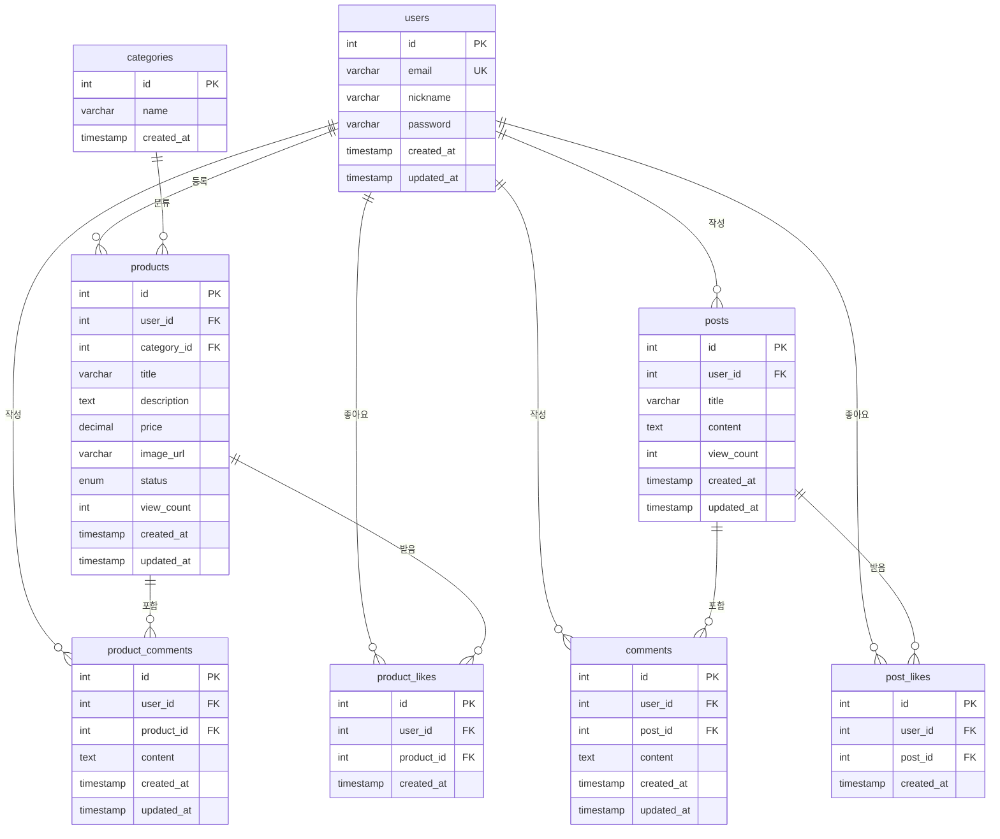

# 판다마켓 ER 다이어그램

```mermaid
erDiagram
    users ||--o{ products : "등록"
    users ||--o{ posts : "작성"
    users ||--o{ comments : "작성"
    users ||--o{ product_comments : "작성"
    users ||--o{ product_likes : "좋아요"
    users ||--o{ post_likes : "좋아요"

    categories ||--o{ products : "분류"
    posts ||--o{ comments : "포함"
    products ||--o{ product_comments : "포함"
    products ||--o{ product_likes : "받음"
    posts ||--o{ post_likes : "받음"

    users {
        int id PK
        varchar email UK
        varchar nickname
        varchar password
        timestamp created_at
        timestamp updated_at
    }

    categories {
        int id PK
        varchar name
        timestamp created_at
    }

    products {
        int id PK
        int user_id FK
        int category_id FK
        varchar title
        text description
        decimal price
        varchar image_url
        enum status
        int view_count
        timestamp created_at
        timestamp updated_at
    }

    posts {
        int id PK
        int user_id FK
        varchar title
        text content
        int view_count
        timestamp created_at
        timestamp updated_at
    }

    comments {
        int id PK
        int user_id FK
        int post_id FK
        text content
        timestamp created_at
        timestamp updated_at
    }

    product_comments {
        int id PK
        int user_id FK
        int product_id FK
        text content
        timestamp created_at
        timestamp updated_at
    }

    product_likes {
        int id PK
        int user_id FK
        int product_id FK
        timestamp created_at
    }

    post_likes {
        int id PK
        int user_id FK
        int post_id FK
        timestamp created_at
    }
```
